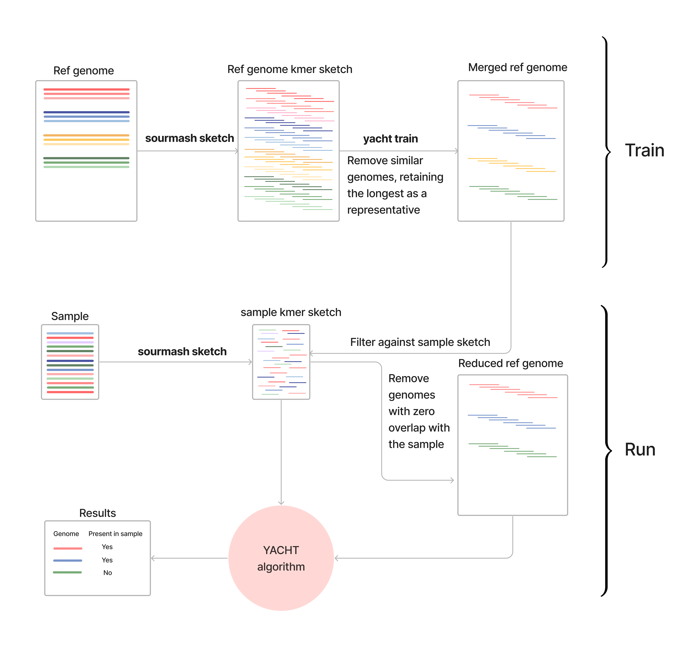

# Summary

In metagenomics, identifying genomes present in a sample is an important initial task, but is complicated by taxonomic profiling tools lacking uncertainty quantification and using incomplete reference databases missing exact genome matches. YACHT (**Y**es/No **A**nswers to **C**ommunity membership via **H**ypothesis **T**esting) [@koslicki2024yacht] is a command-line tool for taxonomic profiling that uses hypothesis testing to confidently determine genome presence/absence in a metagenomic sample. YACHT assists in discovering rare microbiomes by identifying low-abundant species missed in other taxonomic profiling approaches while also controlling the false negative rate. Its statistical model overcomes challenges in sequencing coverage and incomplete genomes, making it ideal for diverse metagenomic applications, including functional profiling, metatranscriptomics, and clinical microbiome analysis.

YACHT presents a robust, $k$-mer sketching-based statistical framework for accurately detecting genetic similarity between the reference database and the metagenomic sample by incorporating evolutionary sequence divergence through the average nucleotide identity (ANI) and sequencing coverage to enable efficient detection of sampled genomes. The workflow for YACHT includes the following commands. To begin, `yacht sketch` creates reduced representation "sketches" of the reference and sample datasets enabling swift comparisons. Then, `yacht train` is used to find a representative of closely related reference genomes using ANI. Lastly, `yacht run` uses the YACHT algorithm to perform hypothesis testing and identify the presence or absence of species. YACHT is developed with C++ and Python and depends on `sourmash` [@irber2024sourmash], a program for extracting and managing $k$-mers.

# Statement of need

Accurately identifying and characterizing microbial communities with low relative abundance is a significant challenge in metagenomics. The current profiling-based practice involves setting arbitrary filter thresholds or discarding low-abundance data without robust justification, which can compromise profiling accuracy and lead to misinterpretations [@schloss2020removal; @jia2022sequencing]. Even with such filtering, the results remain inherently arbitrary because they are influenced by biological complexities such as sequencing errors and evolutionary processes. The lack of a systematic approach to establishing credibility in these results diminishes researchers' confidence in biologically informed methods for identifying rare microorganisms, thereby undermining metagenomic studies. Moreover, these difficulties are exacerbated by the incompleteness of reference databases and the variability in sequencing coverage depth, underscoring the need for statistically credible approaches.

Metagenomic methods rely on existing genome references to detect and classify microbial organisms. However, these reference databases are often incomplete, and conventional metrics may not always align with traditional taxonomic frameworks that account for genomic changes. Consequently, microbes that carry mutations or have diverged evolutionarily can remain undetected, causing inaccuracies in microbial community profiling and misinterpretation of data [@kunin2008bioinformatician; @schlaberg2017validation; @loeffler2020improving; @marcelino2020ccmetagen]. Hence, analytical frameworks need to incorporate genome similarity metrics to capture the full breadth of microbial diversity and to provide accurate, interpretable microbiome dynamics. However, incomplete databases alone do not account for all metagenomic challenges; sequence coverage depth also contributes to the resolution and reliability of microbial detection and characterization.

Sequence coverage depth, defined as the portion of a microbe’s genome detected in a sample, is crucial for detecting low-abundance microbes. However, sequencing processes often fail to achieve complete coverage of all genomes in a sample due to limited sequencing depth. As a result, rare or low-abundance taxa may exhibit low sequence coverage, leading to their misinterpretation as noise rather than genuine observations [@mande2012classification; @shakya2013comparative; @sczyrba2017critical; @meyer2022critical]. Furthermore, the lack of guidelines for establishing a biologically meaningful coverage depth threshold introduces subjectivity and inconsistency in the metagenomic analyses. Therefore, implementing dynamic coverage depth thresholds tailored to varying abundance levels is essential for delivering accurate metagenomic studies. Yet, even if we address coverage depth and incomplete genome reference problems, ensuring proper control over statistical errors remains another major challenge.

Existing metagenomic methods lack the statistical rigor to control false positives and false negatives effectively. High false positive rates misrepresent microbial composition and lead to biased conclusions, undermining research reliability. Conversely, false negative rates cause researchers to overlook important taxa, especially those in low abundance that often carry significant biological importance [@jousset2017less]. Incomplete reference databases, sequencing errors, and evolutionary divergence between reference and sample genomes further complicate these challenges. Therefore, maintaining appropriate control over these statistical error rates is critical to ensure more confident, reliable biological inferences and minimize the risk of misinterpretation. While limitations in reference database, sequence coverage depth and balance of statistical error pose significant challenges, the complexity of metagenomic analysis demands a multifaceted approach to capture microbial profiling accurately.

To address these challenges, YACHT offers a statistical framework that can accurately determine the presence or absence of microbial genome in a sample through hypothesis testing. The algorithm’s mathematical model accounts for evolutionary sequence divergence and incomplete sequencing depth by utilizing genome similarity and minimum sequencing depth parameters. It employs the FracMinHash sketching technique [@Irber2022FracMinHash], an alignment-free $k$-mer approach, facilitating fast and accurate genome detection that can efficiently process large datasets. YACHT ensures precise detection of low abundance taxa with a user-defined false negative rate, minimizing the risk of misinterpretation of the result. Our approach can be used for other metagenomic applications such as functional profiling, metatranscriptomic studies [@marcelino2019metatranscriptomics], metabolic potential analyses [@ward2018metapoap; @pereira2024metatranscriptomics], and the characterization of low abundant clinical metagenomic samples such as skin [@godlewska2020metagenomic]. YACHT enhances metagenomic analysis by offering reduced reliance on arbitrary thresholds, improving the interpretability of the result without compromising biological relevance, and allowing researchers to differentiate between genuine artifacts from “noise” with statistical confidence.

# Workflow

The YACHT workflow involves four primary steps. First, `yacht sketch` samples compact representations of reference genomes using `sourmash`. Second, `yacht train` preprocesses the reference genomes, merging those with high average nucleotide identity (ANI) into a single representative. Third, `yacht run` executes the core YACHT algorithm to perform hypothesis testing and determine the presence or absence of organisms. Finally, `yacht convert` transforms the results into popular output formats like CAMI, BIOM, and GraphPhlAn.

**For the detailed step-by-step workflow, see [the repository](https://github.com/KoslickiLab/YACHT/).

### Output examples
The `yacht run` output provides probabilistic decisions on organism presence or absence. For each organism, columns like `num_matches` and `acceptance_threshold` are reported, indicating the number of $k$-mers found and the minimum required to be considered present, respectively. The `Presence` column then reports `TRUE` or `FALSE` based on this comparison.

\begin{table}[ht]
\centering
\small % Reduce font size for this table
\setlength{\tabcolsep}{4pt} % Shrink column padding
\begin{tabular}{lccp{2.6cm}p{3.2cm}}
\toprule
\textbf{Organism} & \textbf{Presence} & \textbf{num\_matches} & \textbf{acceptance\_threshold} & \textbf{alt\_confidence\_mut\_rate} \\
\midrule
Sediminispirochaeta & TRUE  & 2572 & 895 & 0.053008659 \\
Natronobacterium    & TRUE  & 700  & 638 & 0.053534755 \\
Echinicola          & FALSE & 244  & 978 & 0.052885411 \\
\bottomrule
\end{tabular}
\caption{YACHT results for Sediminispirochaeta, Natronobacterium, and Echinicola are reported. For each species, the following are shown as a subset of the output: whether the organism passed the presence threshold (Presence), the number of exclusive $k$-mer matches (num\_matches), the expected minimum number of matches (acceptance\_threshold), and an alternative confidence estimate for the mutation rate (alt\_confidence\_mut\_rate) are shown. Note that Echinicola is not reported as present, while Sediminispirochaeta and Natronobacterium are present meeting the acceptance threshold. Results were generated using the MBARC-26 dataset (SRA: SRR6394747 by @Singer2016MockCommunity) with YACHT parameters: $k$-size of 31, minimum coverage of 0.05, and ANI threshold of 0.95. Please refer to Use Case Examples for more information.}
\end{table}

<!-- Dummy table to trigger required latex libraries. -->
| |
|--|
| |

# Use case examples

We present the three use case examples to demonstrate the application of YACHT for identifying taxonomy in microbiome studies: (i) analyzing low-abundance metagenomic samples that are common in clinical settings, (ii) performing MAG fishing to detect specific metagenomic-assembled genomes, and (iii) evaluating synthetic microbial communities to identify the presence of specific organisms.

**Low abundance samples:** YACHT can analyze metagenomic samples with low microbial DNA concentrations, which are common in clinical and environmental studies. In this use case example, we adjust the ANI threshold and $k$-size to balance sensitivity and specificy, with higher values increasing stringency and refining species resolution. Using a human skin metagenomic sample, we show that these parameters markedly influence species reporting highlighting the need for careful threshold selection. For more information, refer to [Low abundance samples](https://github.com/KoslickiLab/YACHT/tree/main/use_case_examples/low_abundance_samples).

**Metagenomic-assembled genome (MAG) fishing:** YACHT can be employed to search for specific MAGs of interest within a sample by using a single MAG as the training reference database. Applying this approach to two skin metagenomic samples shows that detection strength varies with sequencing depths and coverage. This use case example illustrates how MAG fishing with YACHT is sensitive to coverage and parameter choice, emphasizing the importance of sequencing depth when assessing MAG presence. Find further detail in [MAG fishing](https://github.com/KoslickiLab/YACHT/tree/main/use_case_examples/MAG_fishing).

**Synthetic metagenomes:** YACHT can assess the construction of mock or synthetic microbial communities to verify that the designed microbes are present. Using a synthetic community from the literature, we show that ANI thresholds can influence accuracy where higher ANI thresholds recover most expected genomes, while lower ones can introduce false positives further highlighitng how parameter choice—particularly ANI and minimum coverage—affect sensitivity and specificity when validating synthetic community composition. For additional information, refer to [Synthetic metagenomes](https://github.com/KoslickiLab/YACHT/tree/main/use_case_examples/synthetic_metagenome)

# Acknowledgements
We thank the contributors and collaborators who supported the development of YACHT. This work was supported in part by the National Institutes of Health (NIH) under grant number 5R01GM146462-03.

# References
