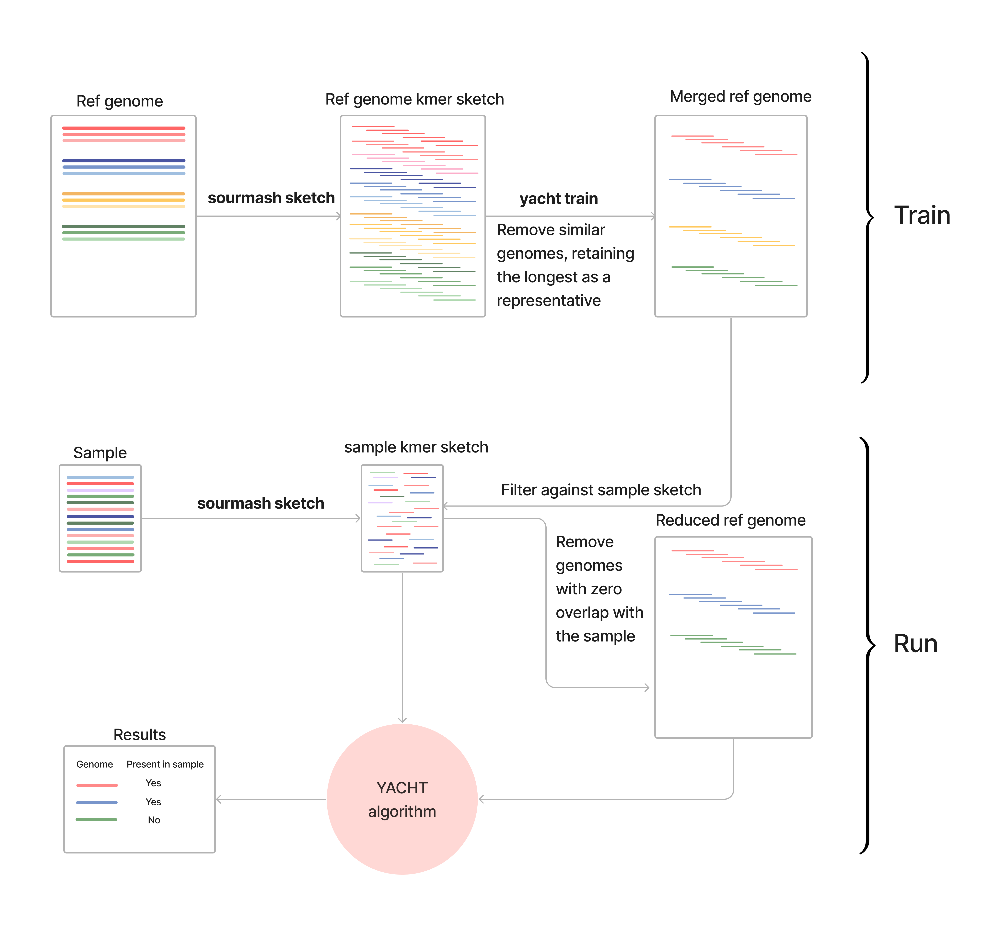

# Summary

Identifying genomes in metagenomics samples can be complicated by taxonomic profiling tools that lack uncertainty quantification and rely on incomplete reference databases. YACHT (**Y**es/No **A**nswers to **C**ommunity membership via **H**ypothesis **T**esting) [@koslicki2024yacht] introduces a $k$-mer sketching based statistical framework that incorporates average nucleotide identity (ANI) and sequencing coverage to detect genetic similarity between reference and sample genomes using binomial hypothesis testing on exclusive $k$-mers to confidently determine genome presence/absence. This paper describes the software implementation of this methodology as a command-line tool that detects low-abundant species while controlling the false-negative rate, making it applicable to functional profiling, metatranscriptomics, and clinical microbiome analysis despite incomplete genomes and variable sequencing coverage. YACHT is developed with C++ and Python and depends on `sourmash` [@irber2024sourmash] for $k$-mer extraction and management.

# Statement of need

Accurately identifying low-abundance microbial communities remains a significant challenge in metagenomics. Current methods rely on arbitrary filter thresholds that, even when applied, produce results skewed by sequencing errors and evolutionary processes, compromising profiling accuracy and leading to misinterpretations [@schloss2020removal; @jia2022sequencing]. The lack of a systematic credibility framework can undermine researcher confidence, a problem compounded by incomplete reference databases and variable sequencing coverage depth.

Metagenomic methods depend on reference databases that are often incomplete and misaligned with taxonomic frameworks, leaving evolutionarily diverged microbes undetected and causing profiling inaccuracies [@kunin2008bioinformatician; @schlaberg2017validation; @loeffler2020improving; @marcelino2020ccmetagen]. Addressing this equires  analytical frameworks that incorporate genome similarity metrics, though sequencing coverage depth presents an additional challenge to reliable microbial detection.

Sequence coverage depth—the portion of a microbe’s genome detected in a sample—is crucial for detecting low-abundance microbes, which are often misinterpreted as noise due to limited sequencing depth [@mande2012classification; @shakya2013comparative; @sczyrba2017critical; @meyer2022critical]. The lack of guidelines for biologically meaningful coverage depth thresholds introduces subjectivity, making dynamic coverage depth thresholds essential. Yet even with adequate coverage and reliable genome references, controlling statistical errors remains a major challenge.

Existing metagenomic methods lack the statistical rigor to control false positives and false negatives effectively, where high false positive rates misrepresent microbial composition and false negative rates cause researchers to overlook biologically important taxa [@jousset2017less]. Incomplete reference databases, sequencing errors, and evolutionary divergence between reference and sample genomes further complicate statistical error rates, making a multifaceted statistical approach essential to capture microbial profiling accurately.

YACHT addresses these challenges through hypothesis testing that accounts for evolutionary sequence divergence and incomplete sequencing depth utilizing genome similarity and minimum sequencing depth parameters. It employs the FracMinHash sketching technique [@irber2020decentralizing; @Irber2022FracMinHash], an alignment-free $k$-mer approach, facilitating fast and accurate detection of low abundance taxa with a user-defined false negative rate. YACHT is applicable to functional profiling, metatranscriptomic studies [@marcelino2019metatranscriptomics], metabolic potential analyses [@ward2018metapoap; @pereira2024metatranscriptomics], and the characterization of low abundant clinical metagenomic samples such as skin [@godlewska2020metagenomic], reducing reliance on arbitrary thresholds and distinguishing genuine artifacts from “noise” with statistical confidence.

# Workflow

The YACHT workflow involves four primary steps. First, `yacht sketch` samples compact representations of reference genomes. Second, `yacht train` preprocesses the reference genomes, merging those with high ANI into a single representative. Third, `yacht run` executes the core YACHT algorithm to perform hypothesis testing and determine the membership of organisms. Finally, `yacht convert` transforms the results into popular output formats like CAMI, BIOM, and GraphPhlAn.

As outlined in the workflow in **Figure 1**, YACHT requires two primary inputs: a pre-trained reference configuration (JSON) and a sketched sample signature. See the [repository](https://github.com/KoslickiLab/YACHT/) for a detailed step-by-step workflow.

### Output examples
The `yacht run` output provides probabilistic decisions on organism presence or absence, as shown in **Table 1** below. For each organism, columns like `num_matches` and `acceptance_threshold` are reported, indicating the number of $k$-mers found and the minimum required to be considered present, respectively. The `Presence` column then reports `TRUE` or `FALSE` based on this comparison.

\begin{table}[ht]
\centering
\small % Reduce font size for this table
\setlength{\tabcolsep}{4pt} % Shrink column padding
\begin{tabular}{lccp{2.6cm}p{3.2cm}}
\toprule
\textbf{Organism} & \textbf{Presence} & \textbf{num\_matches} & \textbf{acceptance\_threshold} & \textbf{alt\_confidence\_mut\_rate} \\
\midrule
Sediminispirochaeta & TRUE  & 2572 & 895 & 0.053008659 \\
Natronobacterium    & TRUE  & 700  & 638 & 0.053534755 \\
Echinicola          & FALSE & 244  & 978 & 0.052885411 \\
\bottomrule
\end{tabular}
\caption{YACHT results for Sediminispirochaeta, Natronobacterium, and Echinicola showing a subset of output columns: whether the organism passed the presence threshold (Presence), the number of exclusive $k$-mer matches (num\_matches), the expected minimum number of matches (acceptance\_threshold), and an alternative confidence estimate for the mutation rate (alt\_confidence\_mut\_rate). Note that Echinicola is not reported as present, while Sediminispirochaeta and Natronobacterium are present meeting the acceptance threshold. Results were generated using the MBARC-26 dataset (SRA: SRR6394747 by @Singer2016MockCommunity) with YACHT parameters: $k$-size of 31, minimum coverage of 0.05, and ANI threshold of 0.95.}
\end{table}

<!-- Dummy table to trigger required latex libraries. -->
| |
|--|
| |

# Use case examples

We present the three use case examples to demonstrate the application of YACHT for identifying taxonomy in microbiome studies: (i) analyzing low-abundance metagenomic samples that are common in clinical settings, (ii) performing MAG fishing to detect specific metagenomic-assembled genomes, and (iii) evaluating synthetic microbial communities to identify the presence of specific organisms.

**Low abundance samples:** YACHT can analyze metagenomic samples with low microbial DNA concentrations common in clinical and environmental studies. Using a human skin metagenomics samples, we show that ANI threshold and k-size markedly influence species specificity. See [Low abundance samples](https://github.com/KoslickiLab/YACHT/tree/main/use_case_examples/low_abundance_samples).

**Metagenomic-assembled genome (MAG) fishing:** Using a single MAG as a training reference database, YACHT searches for specific MAGs within a sample. Applied to two skin metagenomic samples, results shows detection is sensitive to sequencing depth, coverage, and parameter choice. See [MAG fishing](https://github.com/KoslickiLab/YACHT/tree/main/use_case_examples/MAG_fishing).

**Synthetic metagenomes:** YACHT verifies the presence of designed microbes in mock microbial communities. Higher ANI thresholds recover expected genomes while lower thresholds introduce false positives, demonstrating how ANI and minimum coverage parameters affect sensitivy and specificity. See [Synthetic metagenomes](https://github.com/KoslickiLab/YACHT/tree/main/use_case_examples/synthetic_metagenome)

# Acknowledgements
We thank the contributors and collaborators who supported the development of YACHT. This work was supported in part by the National Institutes of Health (NIH) under grant number 5R01GM146462-03.

# References
