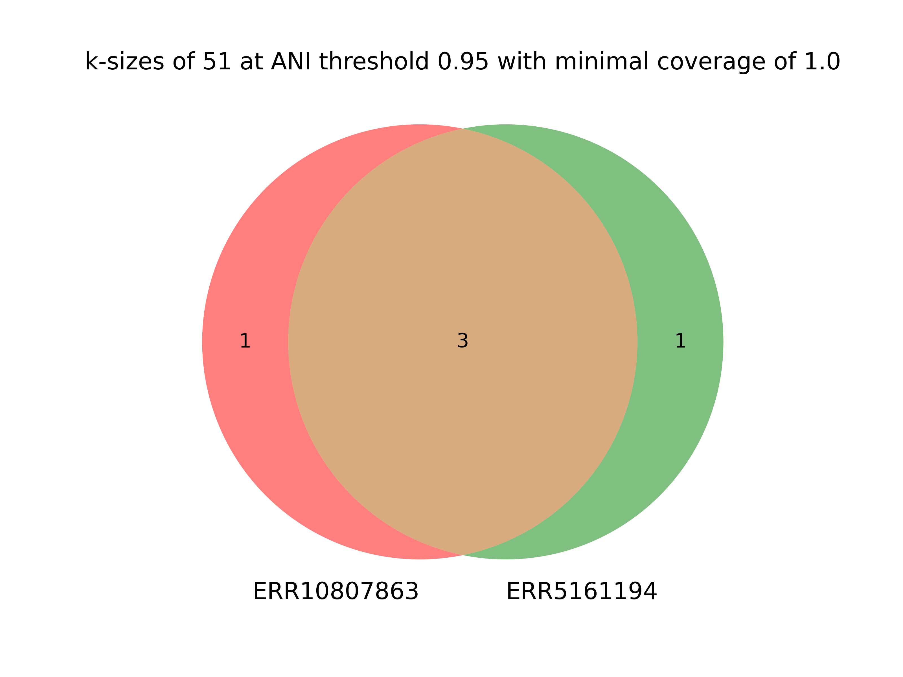

# MAG Fishing

YACHT can be used to fish a metagenome-assembled genome (MAG) of interest in a sample. In the following, we will use two sample datasets to test and evaluate whether the species Tenebrionibacter intestinalis is present in either sample using different parameters. We start our analysis off with a k-size of 51 and maintain an ANI threshold of 0.95. Later, we reduce the k-size to 31 to test how our results are impacted by k-size.

Note that modifying the ANI threshold can also affect results, please refer to the low abundance use case examples for more information.

Make sure you have the following dependencies to run this use case example:

- YACHT
- fastq-dump
- datasets
- matplotlib_venn

## Obtain datasets

Please run the following script to download these samples and the reference genome of interest.

    bash data_download.sh

## Sketch samples of interest

We start off our analysis by sketching samples using `yacht sketch`. 

### Sample ERR10807863:
    yacht sketch sample --infile data/ERR10807863_1.fastq data/ERR10807863_2.fastq --kmer 51 --scaled 1 --outfile ERR10807863.k51.s1.sample.sig.zip
### Sample ERR5161194:
    yacht sketch sample --infile data/ERR5161194_1.fastq data/ERR5161194_2.fastq --kmer 51 --scaled 1 --outfile ERR5161194.k51.s1.sample.sig.zip

## Sketch and train reference for T. intestinalis (MAG reference of interest)

If you completed the low abundance use case example, you may recall that we were able to download pre-trained reference datasets. However, in this use case example, we are only interested in retrieving or "fishing" a single reference MAG, rather than an entire reference database like GTDB. Therefore, we can use a scale factor of 1 and still ensure computational efficiency. This preserves the entire k-mer set preventing any error that YACHT cannot match a k-mer from the MAG to our samples. Additionally, this reference will be a sketch using "--singleton" meaning that each entry within the FASTA/Q file will have a unique signature. Specifically, every entry in this reference file is a scaffold and has not yet been annotated.

    yacht sketch ref --infile data/ncbi_dataset/data/GCF_016632365.1/GCF_016632365.1_ASM1663236v1_genomic.fna --kmer 51 --scaled 1 --outfile training_database.k51.sig.zip

    yacht train --ref_file training_database.k51.sig.zip --ksize 51 --num_threads 32 --ani_thresh 0.95 --prefix 'training_database_ani0.95_k51' --outdir ./

## Run `yacht run` for both samples

### Sample ERR10807863
    yacht run --json 'training_database_ani0.95_k51_config.json' --sample_file 'ERR10807863.k51.s1.sample.sig.zip' --num_threads 32 --keep_raw --significance 0.95 --min_coverage_list 1 0.5 0.1 0.05 0.01 --out ./ERR10807863.k51.result.xlsx

### Sample ERR5161194

    yacht run --json 'training_database_ani0.95_k51_config.json' --sample_file 'ERR5161194.k51.s1.sample.sig.zip' --num_threads 32 --keep_raw --significance 0.95 --min_coverage_list 1 0.5 0.1 0.05 0.01 --out ./ERR5161194.k51.result.xlsx

## Results

Using a k-size of 51, we look at results for a minimum coverage of 1.0. These two samples share 3 scaffolds and each sample consist of a unique scaffold.

    python venn.py --ksize 51 --mincov 1.0

Let's take a closer look at the results to one of those unique scaffolds. At a k-size of 51, sample ERR10807863 has Scaffold28 reported as present. The reason being that the total number of k-mers matched to the MAG required based on the threshold (4,204) to accept a genome as present, therefore 6,278/4,204 within the threshold and categorized as detected. For the other sample, ERR5161194, 297/4,204 is outside of this threshold and is not detected.

| Sample      | ksize | Organism                                                                 | in_sample_est | num_exclusive_kmers_to_genome | num_exclusive_kmers_to_genome_coverage | num_matches | acceptance_threshold_wo_coverage |
|------------|------|--------------------------------------------------------------------------|--------------|-------------------------------|----------------------------------------|-------------|----------------------------------|
| ERR10807863 | 51   | *Tenebrionibacter intestinalis* strain BIT-L3 (NZ_JAEPBH010000028.1, Scaffold28) | TRUE         | 58,932                        | 58,932                                 | 6,278       | 4,204                            |
| ERR5161194  | 51   | *Tenebrionibacter intestinalis* strain BIT-L3 (NZ_JAEPBH010000028.1, Scaffold28) | FALSE        | 58,932                        | 58,932                                 | 297         | 4,204                            |

## Sketching the sample and MAG of interest, but this time decreasing the k-size to 31

### Sample ERR10807863:
    yacht sketch sample --infile data/ERR10807863_1.fastq data/ERR10807863_2.fastq --kmer 31 --scaled 1 --outfile ERR10807863.k31.sample.sig.zip
### Sample ERR5161194:
    yacht sketch sample --infile data/ERR5161194_1.fastq data/ERR5161194_2.fastq --kmer 31 --scaled 1 --outfile ERR5161194.k31.sample.sig.zip

## Sketch and train reference for T. intestinalis (MAG reference of interest) using a smaller k-size

    yacht sketch ref --infile data/ncbi_dataset/data/GCF_016632365.1/GCF_016632365.1_ASM1663236v1_genomic.fna --kmer 31 --scaled 1 --outfile training_database.k31.sig.zip

    yacht train --ref_file training_database.k51.sig.zip --ksize 31 --num_threads 32 --ani_thresh 0.95 --prefix 'training_database_ani0.95_k31' --outdir ./

## Rerun `yacht run` to identify presence of MAG

### Sample ERR10807863

    yacht run --json 'training_database_ani0.95_k51_config.json' --sample_file 'ERR10807863.k31.sample.sig.zip' --num_threads 32 --keep_raw --significance 0.95 --min_coverage_list 1 0.5 0.1 0.05 0.01 --out ./ERR10807863.k31.result.xlsx

### ERR5161194

    yacht run --json 'training_database_ani0.95_k31_config.json' --sample_file 'ERR5161194.k31.sample.sig.zip' --num_threads 32 --keep_raw --significance 0.95 --min_coverage_list 1 0.5 0.1 0.05 0.01 --out ./ERR5161194.k31.result.xlsx

## Results

Run a similar script as before:

    python venn.py --ksize 31 --mincov 1.0

Here, reducing the k-size suggests less statistical power. At a coverage of 1.0, there are less scaffolds detected. Specifically, we first observed scaffold28 to be present in sample ERR10807863 at a larger k-size but at a k-size of 31, it is no longer being detected.

| Sample      | k-size | Organism                                                                 | min_coverage | in_sample_est | num_exclusive_kmers_to_genome | num_exclusive_kmers_to_genome_coverage | num_matches | acceptance_threshold_wo_coverage |
|------------|--------|--------------------------------------------------------------------------|--------------|--------------|-------------------------------|----------------------------------------|-------------|----------------------------------|
| ERR10807863 | 31     | *Tenebrionibacter intestinalis* strain BIT-L3 (NZ_JAEPBH010000028.1, Scaffold28) | 1            | FALSE        | 58,854                        | 58,854                                 | 7,799       | 11,840                            |
| ERR5161194  | 31     | *Tenebrionibacter intestinalis* strain BIT-L3 (NZ_JAEPBH010000028.1, Scaffold28) | 1            | FALSE        | 58,854                        | 58,854                                 | 357         | 11,840                            |

## Running YACHT using a reference MAG sketched as one signature

Let's ignore scaffolds for this part and what if we sketch our MAG of interest as one signature. Will T. intestinalis be reported?

In the previous examples, we used `yacht sketch ref` to sketch the MAG reference, which creates a signature for every entry within the FASTA/A input file. For this example, we use sourmash to sketch the MAG reference to sketch the FASTA/Q inptu file as one signature to evaluate whether we can find T. internalis in these samples with just one signature of the reference.

### Use `sourmash sketch dna` to sketch the MAG reference as one signature (k=51):

    sourmash sketch dna -f -p k=51,scaled=1 /data/jzr5814/YACHT_use_case_examples/mag_fishing/data/ncbi_dataset/data/GCF_016632365.1/GCF_016632365.1_ASM1663236v1_genomic.fna -o training_database_combined.k51.sig.zip

### Run `yacht train` using ani=0.95:

    yacht train --ref_file training_database_combined.k51.sig.zip --ksize 51 --num_threads 32 --ani_thresh 0.95 --prefix 'training_database_combined_ani0.95_k51' --outdir ./

### yacht run
    yacht run --json 'training_database_combined_ani0.95_k51_config.json' --sample_file 'ERR10807863.k51.sample.sig.zip' --num_threads 32 --keep_raw --significance 0.95 --min_coverage_list 1 0.5 0.1 0.05 0.01 --out ./ERR10807863.k51.training_database_combined.result.xlsx

### Results:

Genome was not reported

<!-- ## Let's reduce the k-size

Okay so that did not work, so what if we decrease the k-size to 31?

k=31, ANI=0.95

### Let's sketch our MAG of interest as one signature again but using a k-size of 31

sourmash sketch dna -f -p k=31,scaled=1 /data/jzr5814/YACHT_use_case_examples/mag_fishing/data/ncbi_dataset/data/GCF_016632365.1/GCF_016632365.1_ASM1663236v1_genomic.fna -o training_database_combined.k31.sig.zip

### Train

yacht train --ref_file training_database_combined.k31.sig.zip --ksize 31 --num_threads 32 --ani_thresh 0.95 --prefix 'training_database_combined_ani0.95_k31' --outdir ./

### yacht run

nohup yacht run --json 'training_database_combined_ani0.95_k31_config.json' --sample_file 'ERR10807863.k31.sample.sig.zip' --num_threads 32 --keep_raw --significance 0.95 --min_coverage_list 1 0.5 0.1 0.05 0.01 --out ./ERR10807863.k31.training_database_combined.result.xlsx > ERR10807863.k31.training_database_combined.result.log 2>&1 &

### Results

Decreasing the k-size did not work and no significant results were reported. 

Let's try decreasing the ANI threshold to 0.90.

Train:

    yacht train --ref_file training_database_combined.k31.sig.zip --ksize 31 --num_threads 32 --ani_thresh 0.90 --prefix 'training_database_combined_ani0.90_k31' --outdir ./

yacht run:

    nohup yacht run --json 'training_database_combined_ani0.90_k31_config.json' --sample_file 'ERR10807863.k31.sample.sig.zip' --num_threads 32 --keep_raw --significance 0.90 --min_coverage_list 1 0.5 0.1 0.05 0.01 --out ./ERR10807863.k31.training_database_combined.result.xlsx > ERR10807863.k31.training_database_combined.result.log 2>&1 &

Results: That did not work as well. 

Try with increasing the k-size to 51 --!>