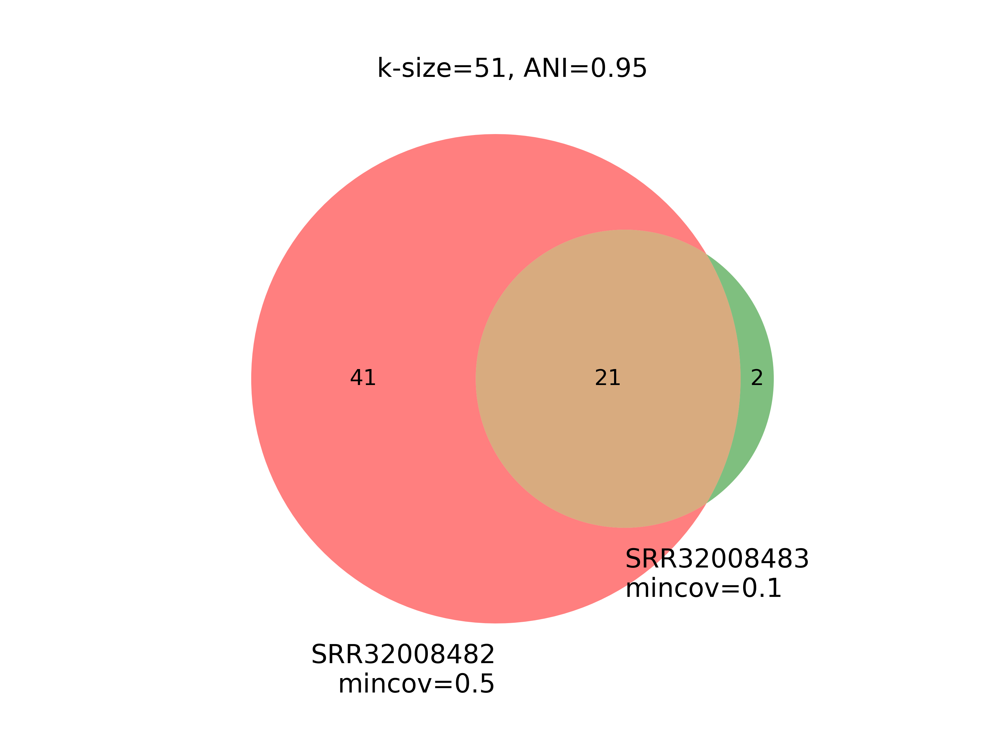

# MAG Fishing V2

## Introduction

YACHT can be used to search or "fish" for a metagenome-assembled genome (MAG) of interest in a sample. In the following, we will use two sample datasets to test and evaluate whether the species XYZ is present in either sample using different parameters. We start our analysis off with a k-size of 51 and maintain an ANI threshold of 0.95. Later, we reduce the k-size to 31 to test how our results are impacted by k-size.

Make sure you have the following dependencies to run this use case example:

- YACHT
- fastq-dump
- datasets
- matplotlib_venn

## Obtain datasets

Throughout this use case example, we will use this sample dataset to test and evaluate how results may change when modifying parameters such as k-size and ANI thresholds.

Please run the following script to download these samples and the reference MAG of interest.

    bash data_download.sh

## Sketch samples of interest

We start off our analysis by sketching samples using `yacht sketch sample`. 

### Sample SRR32008482:
    yacht sketch sample --infile data/SRR32008482.fastq --kmer 51 --scaled 1000 --outfile SRR32008482.k51.sample.sig.zip
### Sample SRR32008483:
    yacht sketch sample --infile data/SRR32008483.fastq --kmer 51 --scaled 1000 --outfile SRR32008483.k51.sample.sig.zip

## I want to identify whether these two share a species

I downloaded pre-trained reference signature using `yacht download`.

    yacht download pretrained_ref_db --database gtdb --db_version rs214 --k 51 --ani_thresh 0.95 --outfolder ./

Now I run `yacht run` for both samples

    nohup yacht run --json 'gtdb-rs214-reps.k51_0.95_pretrained/gtdb-rs214-reps.k51_0.95_config.json' --sample_file 'SRR32008482.k51.sample.sig.zip' --num_threads 32 --keep_raw --significance 0.95 --min_coverage_list 1 0.5 0.1 0.05 0.01 --out ./result_k51_ani0.95_SRR32008482.xlsx > run.k51.SRR32008482.log 2>&1 &

    nohup yacht run --json 'gtdb-rs214-reps.k51_0.95_pretrained/gtdb-rs214-reps.k51_0.95_config.json' --sample_file 'SRR32008483.k51.sample.sig.zip' --num_threads 32 --keep_raw --significance 0.95 --min_coverage_list 1 0.5 0.1 0.05 0.01 --out ./result_k51_ani0.95_SRR32008483.xlsx > run.k51.SRR32008483.log 2>&1 &

Do these share any genomes?

Using a k-size of 51, we look at results for a minimum coverage of 0.05. Both of these samples share 21 species, where Sample SRR32008483 has 9 unique species and Sample SRR32008483 has 200 unique species.

    python venn.py

## Can we find the MAG Ruminococcaceae bacterium in both of these samples?

If you completed the low abundance use case example, you may recall that we were able to download pre-trained reference datasets. However, in this use case example, we are only interested in retrieving or "fishing" a single reference MAG, rather than an entire reference database like GTDB. Therefore, we can use a scale factor of 1 and still ensure computational efficiency. This preserves the entire k-mer set preventing any error that YACHT cannot match a k-mer from the MAG to our samples. Additionally, this reference will be a sketch using "--singleton" meaning that each entry within the FASTA/Q file will have a unique signature. Specifically, every entry in this reference file is a scaffold and has not yet been annotated.
<!--
    yacht sketch ref --infile data/ncbi_dataset/data/GCF_016632365.1/GCF_016632365.1_ASM1663236v1_genomic.fna --kmer 51 --scaled 1 --outfile training_database.k51.sig.zip

    yacht train --ref_file training_database.k51.sig.zip --ksize 51 --num_threads 32 --ani_thresh 0.95 --prefix 'training_database_ani0.95_k51' --outdir ./ 

### Identify whether <species xyz> is present or absence of species using yacht run

    
    yacht run --json 'gtdb_ani_thresh_0.95_config.json' --sample_file 'sample.31.sig.zip' --num_threads 32 --keep_raw --significance 0.95 --min_coverage_list 1 0.5 0.1 0.05 0.01 --out ./result_k31_ani0.95.xlsx

## Results

## Will <species XYZ> still be present when decreasing k-size to 31

### Sketch sample

Sketch the sample dataset using a k-size of 21.

    yacht sketch sample --infile data/SRR32008482.fastq --kmer 21 --scaled 1000 --outfile sample.21.sig.zip

### Train reference

Here, we will train our reference signature. We conitnue to use an ANI threshold of 0.95, but using a k-size of 21.

    yacht train --ref_file data/gtdb-rs214-k21.zip --ksize 21 --num_threads 64 --ani_thresh 0.95 --prefix 'gtdb_ani_thresh_0.95' --outdir ./

### How will using a smaller k-size change the identifcation of presence or absence of species when using yahct run?

    yacht run --json 'gtdb_ani_thresh_0.95_config.json' --sample_file 'sample.21.sig.zip' --num_threads 32 --keep_raw --significance 0.95 --min_coverage_list 1 0.5 0.1 0.05 0.01 --out ./result_k21_ani0.95.xlsx

## Increase k-size to 51

### Sketch sample

Sketch the sample dataset using a k-size of 51.

    yacht sketch sample --infile data/SRR32008482.fastq --kmer 51 --scaled 1000 --outfile sample.51.sig.zip

### Train reference

To train our reference signature, conitnue using an ANI threshold of 0.95 increasing the k-size to 51.

    yacht train --ref_file data/gtdb-rs214-k51.zip --ksize 21 --num_threads 64 --ani_thresh 0.95 --prefix 'gtdb_ani_thresh_0.95' --outdir ./

### Run yacht run and observe difference in species presence/absence output

    yacht run --json 'gtdb_ani_thresh_0.95_config.json' --sample_file 'sample.51.sig.zip' --num_threads 32 --keep_raw --significance 0.95 --min_coverage_list 1 0.5 0.1 0.05 0.01 --out ./result_k51_ani0.95.xlsx

## Results

Run following script to produce figure.

    python venn_ksize.py

## Using default k-size 31 and increasing ANI to 0.9995

Now that we know what happens when the k-size is either decreased or increased, let's tune the ANI threshold!

### Train reference

Note that we have the signature for the samplle using a k-size of 31, so we can move forward to training our reference signature using an ANI threshold of 0.9995.

    yacht train --ref_file data/gtdb-rs214-k31.zip --ksize 31 --num_threads 64 --ani_thresh 0.9995 --prefix 'gtdb_ani_thresh_0.9995' --outdir ./

### Run yacht run and observe difference in species presence/absence output

    yacht run --json 'gtdb_ani_thresh_0.9995_config.json' --sample_file 'sample.31.sig.zip' --num_threads 32 --keep_raw --significance 0.95 --min_coverage_list 1 0.5 0.1 0.05 0.01 --out ./result_k31_ani0.9995.xlsx

## using default k-size 31 and decreasing ANI to 0.90

### Train reference

Train our reference signature reducing the ANI threshold to 0.90.

    yacht train --ref_file data/gtdb-rs214-k31.zip --ksize 31 --num_threads 64 --ani_thresh 0.90 --prefix 'gtdb_ani_thresh_0.90' --outdir ./

### Run yacht run and observe difference in species presence/absence output

    yacht run --json 'gtdb_ani_thresh_0.90_config.json' --sample_file 'sample.31.sig.zip' --num_threads 32 --keep_raw --significance 0.95 --min_coverage_list 1 0.5 0.1 0.05 0.01 --out ./result_k31_ani0.90.xlsx

## Results

Run following script to produce figure.

    python venn_ani.py

-->