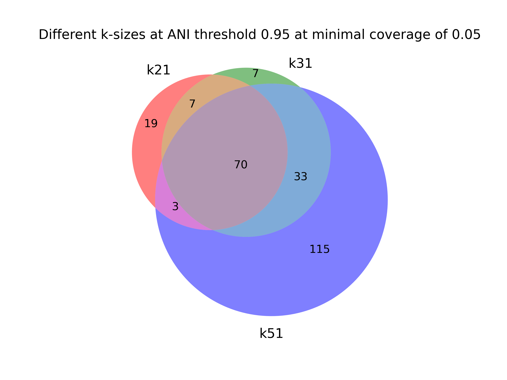
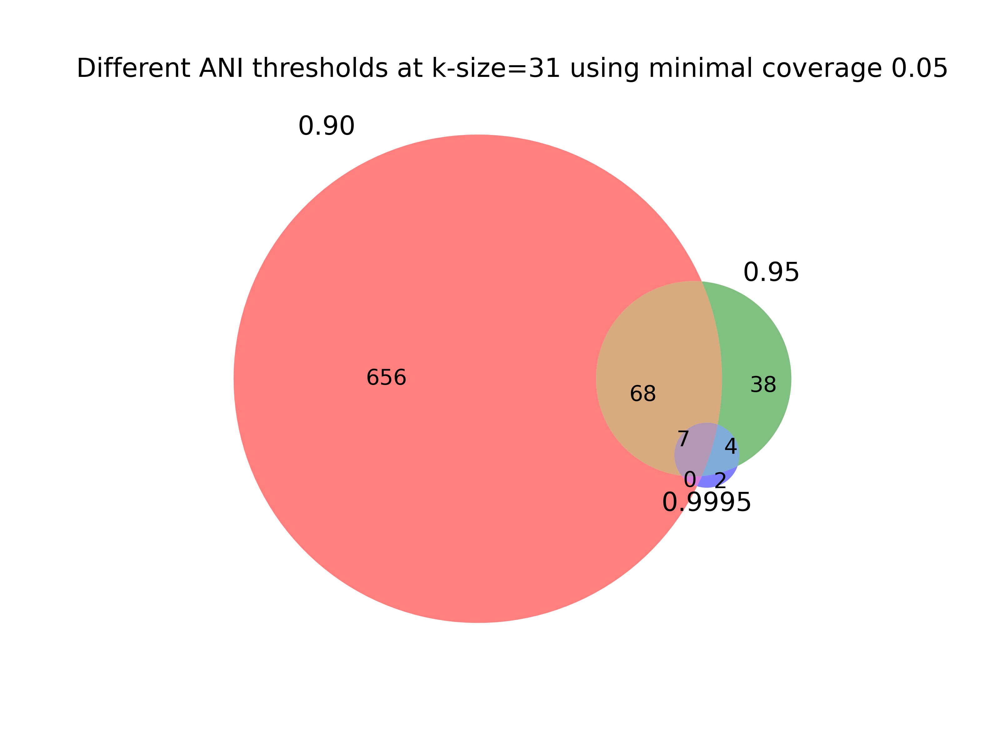

# Low abundance samples

## Introduction

If it's your first time using YACHT, we recommend to first use the default parameters, a k-size of 31 and an ANI threshold of 0.95.

Make sure you have the following dependencies to run this use case example:

- fastq-dump

## Obtain datasets

Throughout this use case example, we will use this sample dataset to test and evaluate how results may change when modifying parameters such as k-size and ANI thresholds.

Create a data folder for your sample and reference datasets.

`mkdir data`

### Download sample to data folder

`fasterq-dump --concatenate-reads SRR32008482  -O data`

### Download a pre-sketeched reference signatures to the same data folder

To run our use case examples, there is no need to start from stratch. We will download and use pre-created reference signatures for a k-size of 21, 31, and 51. You can find additional reference signatures at https://sourmash.readthedocs.io/en/latest/databases.html#id9 

k-size=21

`wget https://farm.cse.ucdavis.edu/~ctbrown/sourmash-db/gtdb-rs214/gtdb-rs214-k21.zip --directory-prefix=data`

k-size=31

`wget https://farm.cse.ucdavis.edu/~ctbrown/sourmash-db/gtdb-rs214/gtdb-rs214-k31.zip --directory-prefix=data`

k-size=51

`wget https://farm.cse.ucdavis.edu/~ctbrown/sourmash-db/gtdb-rs214/gtdb-rs214-k51.zip --directory-prefix=data`

## Using YACHT's default parameters: k-size=31, ani_thresh=0.95

### Sketch sample

Sketch the sample dataset using the same k-size used for the reference.

`yacht sketch sample --infile data/SRR32008482.fastq --kmer 31 --scaled 1000 --outfile sample.31.sig.zip`

### Train reference

Note, we didn't need to sketch the reference, since we were able to download the pre-created signatures, but if you provide YACHT with your own reference, you'll need to sketch it. Please see: https://github.com/KoslickiLab/YACHT?tab=readme-ov-file#creating-sketches-of-your-reference-database-genomes-yacht-sketch-ref 

Here, we will train our reference signature. We are using an ANI threshold of 0.95. This means that any species that is within that threshold will combine.

`yacht train --ref_file ../data/gtdb-rs214-k31.zip --ksize 31 --num_threads 64 --ani_thresh 0.95 --prefix 'gtdb_ani_thresh_0.95' --outdir ./`

### Identify presence or absence of species using yacht run

`yacht run --json 'gtdb_ani_thresh_0.95_config.json' --sample_file 'sample.31.sig.zip' --num_threads 32 --keep_raw --significance 0.95 --min_coverage_list 1 0.5 0.1 0.05 0.01 --out ./result_k31_ani0.95.xlsx`

## Decrease k-size to 21

### Sketch sample

Sketch the sample dataset using a k-size of 21.

`yacht sketch sample --infile data/SRR32008482.fastq --kmer 21 --scaled 1000 --outfile sample.21.sig.zip`

### Train reference

Here, we will train our reference signature. We conitnue to use an ANI threshold of 0.95, but using a k-size of 21.

`yacht train --ref_file ../data/gtdb-rs214-k21.zip --ksize 21 --num_threads 64 --ani_thresh 0.95 --prefix 'gtdb_ani_thresh_0.95' --outdir ./`

### How will using a smaller k-size change the identifcation of presence or absence of species when using yahct run?

`yacht run --json 'gtdb_ani_thresh_0.95_config.json' --sample_file 'sample.21.sig.zip' --num_threads 32 --keep_raw --significance 0.95 --min_coverage_list 1 0.5 0.1 0.05 0.01 --out ./result_k21_ani0.95.xlsx`

## Increase k-size to 51

### Sketch sample

Sketch the sample dataset using a k-size of 51.

`yacht sketch sample --infile data/SRR32008482.fastq --kmer 51 --scaled 1000 --outfile sample.51.sig.zip`

### Train reference

To train our reference signature, conitnue using an ANI threshold of 0.95 increasing the k-size to 51.

`yacht train --ref_file ../data/gtdb-rs214-k51.zip --ksize 21 --num_threads 64 --ani_thresh 0.95 --prefix 'gtdb_ani_thresh_0.95' --outdir ./`

### Run yacht run and observe difference in species presence/absence output

`yacht run --json 'gtdb_ani_thresh_0.95_config.json' --sample_file 'sample.51.sig.zip' --num_threads 32 --keep_raw --significance 0.95 --min_coverage_list 1 0.5 0.1 0.05 0.01 --out ./result_k51_ani0.95.xlsx`

## Results

Run following script to produce figure.

`python venn_ksize.py`

## Using default k-size 31 and increasing ANI to 0.9995

Now that we know what happens when the k-size is either decreased or increased, let's tune the ANI threshold!

### Train reference

Note that we have the signature for the samplle using a k-size of 31, so we can move forward to training our reference signature using an ANI threshold of 0.9995.

`yacht train --ref_file ../data/gtdb-rs214-k31.zip --ksize 31 --num_threads 64 --ani_thresh 0.9995 --prefix 'gtdb_ani_thresh_0.9995' --outdir ./`

### Run yacht run and observe difference in species presence/absence output

`yacht run --json 'gtdb_ani_thresh_0.9995_config.json' --sample_file 'sample.31.sig.zip' --num_threads 32 --keep_raw --significance 0.95 --min_coverage_list 1 0.5 0.1 0.05 0.01 --out ./result_k31_ani0.9995.xlsx`

## using default k-size 31 and decreasing ANI to 0.90

### Train reference

Train our reference signature reducing the ANI threshold to 0.90.

`yacht train --ref_file ../data/gtdb-rs214-k31.zip --ksize 31 --num_threads 64 --ani_thresh 0.90 --prefix 'gtdb_ani_thresh_0.90' --outdir ./`

### Run yacht run and observe difference in species presence/absence output

`yacht run --json 'gtdb_ani_thresh_0.90_config.json' --sample_file 'sample.31.sig.zip' --num_threads 32 --keep_raw --significance 0.95 --min_coverage_list 1 0.5 0.1 0.05 0.01 --out ./result_k31_ani0.90.xlsx`

## Results

Run following script to produce figure.

`python venn_ani.py`

