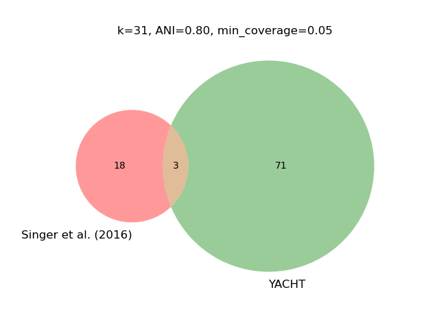

# Synthetic Metagenome

## Introduction

Use YACHT to verify expected species within a synthetic metagenome. We use a sample from MBARC-26 (SRA: SRR6394747, Singer et al., 2016) to explore how ANI can influence reporting the presence of expected species of a mock community composed of 26 species.

## Obtain datasets

This use case example will use the same sample dataset to test and evaluate how results may change when modifying the ANI threshold.

Before running this step, ensure you have the following dependency:

- fastq-dump

    fasterq-dump --split-files SRR6394747

## Sketch sample

Sketch the sample dataset using the a k-size of 31 and scale factor of 1000. Note, this signature will be used for all ANIs evaluated in this use case example.

    yacht sketch sample --infile SRR6394747.fastq --kmer 31 --scaled 1000 --outfile sample.sig.zip

## ANI threshold of 0.95

We begin our evaluation of YACHT by using the default threshold for ANI, 0.95.

### Training reference dataset

YACHT offers the option to download pretrained reference databases, and we execute the following command to obtain the pretrained reference database that uses an ANI of 0.95:

    yacht download pretrained_ref_db --database gtdb --db_version rs214 --k 31 --ani_thresh 0.95 --outfolder ./

### Identify presence of microbes in mock community using yacht run

    yacht run --json 'gtdb-rs214-reps.k31_0.95_pretrained/gtdb-rs214-reps.k31_0.95_config.json' --sample_file 'sample.sig.zip' --num_threads 32 --keep_raw --significance 0.95 --min_coverage_list 0.25 0.05 0.0001 --out ./result_k31_ani0.95.xlsx

### Results using an ANI threshold of 0.95

18 species are reported as present, while 8 of those were not, this is likely due to these microbes having a lower sequence coverage resulting in less unique k-mers.

## ANI threshold of 0.95 and reducing the scale factor to 500

### Results using an ANI threshold of 0.95 but reducing the scale factor to 100

## ANI threshold of 0.9995

We increase the ANI threshold to 0.9995.

### Download a pre-trained reference dataset that uses an ANI threshold of 0.9995

    yacht download pretrained_ref_db --database gtdb --db_version rs214 --k 31 --ani_thresh 0.9995 --outfolder ./

### Using an ANI threshold of 0.9995, report species present in mock community sample

    yacht run --json 'gtdb-rs214-reps.k31_0.9995_pretrained/gtdb-rs214-reps.k31_0.9995_config.json' --sample_file 'sample.sig.zip' --num_threads 32 --keep_raw --significance 0.9995 --min_coverage_list 1 0.5 0.1 0.05 0.01 --out ./result_k31_ani0.9995.xlsx

### Results using an ANI threshold of 0.9995

Using a k-=mer of 31 and minimum coverage of 0.05, an ANI threshold of 0.9995 may be too restrictive. Compared to when using an ANI of 0.95, the expected species reported as present slightly decreased to 16.

## ANI threshold of 0.80

Using an ANI of 0.80 may produce false postives and therefore, we advise against this. In the following, we decrease the ANI to 0.80 to show just this.

### Download a pre-trained reference dataset that uses an ANI threshold of 0.80

    yacht download pretrained_ref_db --database gtdb --db_version rs214 --k 31 --ani_thresh 0.80 --outfolder ./

### Using an ANI threshold of 0.80, report species present in mock community sample

    yacht run --json 'gtdb-rs214-reps.k31_0.80_pretrained/gtdb-rs214-reps.k31_0.80_config.json' --sample_file 'sample.sig.zip' --num_threads 32 --keep_raw --significance 0.80 --min_coverage_list 1 0.5 0.1 0.05 0.01 --out ./result_k31_ani0.80.xlsx

### Results using an ANI threshold of 0.80

As expected, using a very low ANI such as 0.80 produces many false positives, reporting the presence of unexpected microbes in the sample. Meanwhile, only 3 species correctly identified as present.

To produce the figures in this use case example, execute:

    python venn.py

## Reference

Esther Singer, Bill Andreopoulos, Robert M Bowers, Janey Lee, Shweta Deshpande, Jennifer Chiniquy, Doina
Ciobanu, Hans-Peter Klenk, Matthew Zane, Christopher Daum, et al. Next generation sequencing data of a
defined microbial mock community. Scientific data, 3(1):1–8, 2016.